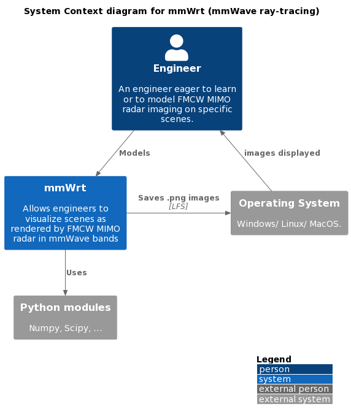

# Overview

An overview of the context in which mmWrt is intended to be used, its key components and relative interactions

## Context

Below diagram shows the context in which mmWrt operates




## mmWrt Components

* Scene: Classes used to define the scene
* Raytracing: functions used to generate the IF signals
* Radar Signal processing: functions used to process the IF signals

## Credits

> This overview leverages the [C4 model for visualising software architecture](https://c4model.com/)

> C4 diagram templates credits: [C4-Plantuml](https://github.com/plantuml-stdlib/C4-PlantUML/blob/master/samples/C4CoreDiagrams.md)

### Plantuml references

```plantuml
@startuml
!include https://raw.githubusercontent.com/plantuml-stdlib/C4-PlantUML/master/C4_Context.puml
' uncomment the following line and comment the first to use locally
' !include C4_Context.puml

LAYOUT_WITH_LEGEND()

title System Context diagram for mmWrt (mmWave ray-tracing)

Person(engineer, "Engineer", "An engineer eager to learn or to model FMCW MIMO radar imaging on specific scenes.")
System(mmWrt, "mmWrt", "Allows engineers to visualize scenes as rendered by FMCW MIMO radar in mmWave bands")

System_Ext(OS, "Operating System", "Windows/ Linux/ MacOS.")
System_Ext(mainframe, "Python modules", "Numpy, Scipy, ...")

Rel(engineer, mmWrt, "Models")
Rel_Back(engineer, OS, "images displayed")
Rel_Neighbor(mmWrt, OS, "Saves .png images", "LFS")
Rel(mmWrt, mainframe, "Uses")
@enduml
```

[online editing](https://www.plantuml.com/plantuml/png/PP11Rzim38Nl_XLSBqk1rhxij5ExBDqAn4amDmXs2XY9SOH9b279RRnVFofnYcmxYH3vtll8XvWmfDxPueDXPNjDS4YfYv-hAk1RsPfqw7TzfA0y9-9KAk-gpY9dpNrCsffTDVrqlyfVwtfUEOo9WdnjfrbnJ6MNtJz2po9rOW7fGB3trletmorOmmJ86lvgcn2byY3HOBr2QmVnU6VyrxwOF_vShb-sc-UNxzlvxDjiyNLoMnJ994lG38BaO1I0DjW6T88GmBbDI32H1ry90WxtAQ0IB16lA4JF4-9M22dSmSriB6-aVcIuT82mfP1fBM5WyAVQUKqMdkhf1khdUYdc6WCOXstUsZF4ZfJP6mLH4LCiRswBC-daH2KPf_SKbeyLtmDZzdyriKThVjEe1umGY3K5qh0R_azc6DVS8UieQMFSTdPCasKZCSkE0gQCT-xaw8rXBTaLp0ttnmfgLCj6MA_53Wtl0pgI-TMG3fxpzhsbc1qMlUk6EsYKoKzPPd7nW-pLPIyBr_bc6KtQso-eVbtDd0Zp-IY2Dh6pE90UHnTasiFEX_Fbnjb6TerGThBEMPPXva_DMNCPlMPVHyhX3yIwT_OF)
